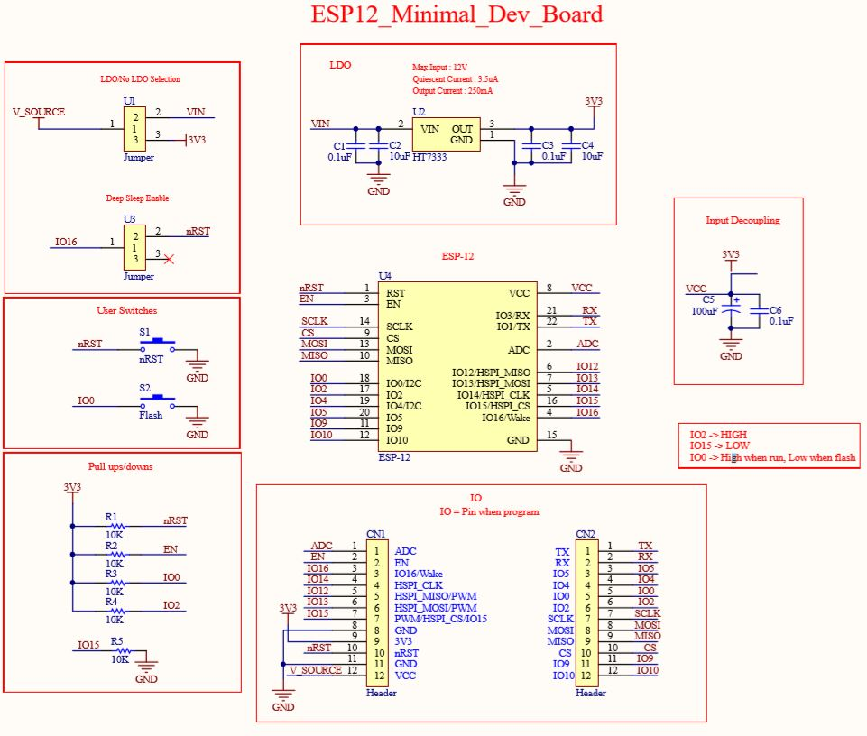
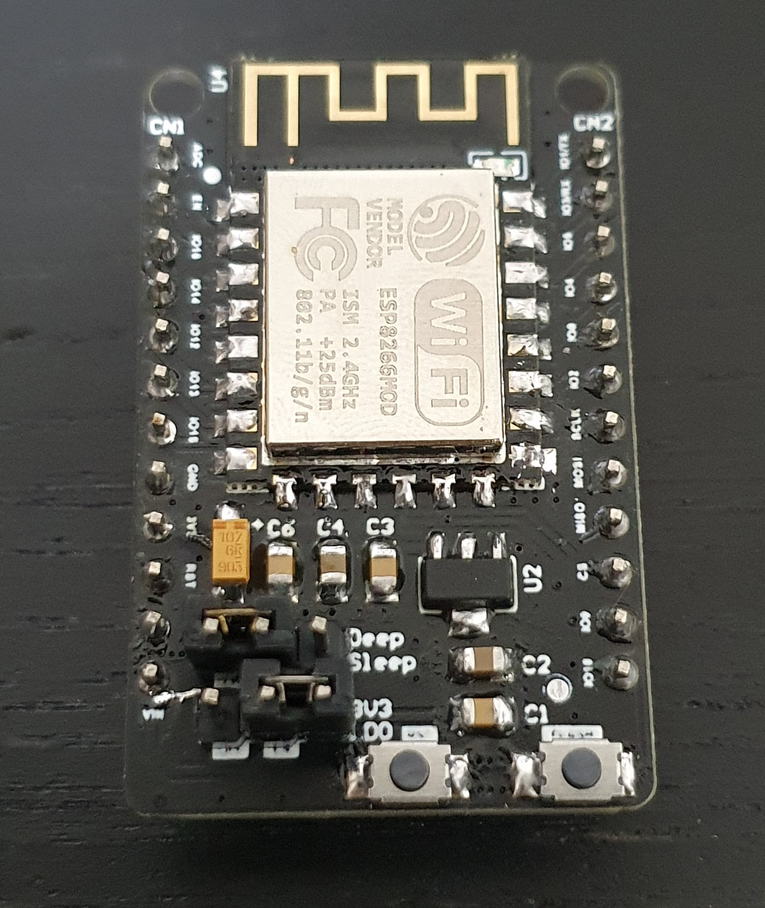

# ESP12_Minimal_Development Board
# (On-going, waiting for PCB to be manufactured)
## Goal:
There are many dev boards out there however that all have additional functinos/Ic's that consumes unnecessary power, thus not suitable for low power projects. 
Thus. this project is to develop a breakout for ESP12 series chips that draws minimal power while supporting all basic dev functions.
(User flash and reset)
## Requirments:
1. Consume least power as possible, as close to the esp12 stated current in deel sleep mode (4uA).
2. Able to configure input power route (Through 3.3V regulation or straight from source)
3. Internal connection from Pin 16 to rst for deep sleep enable.
4. Small and compact design, easy for user to use.
## Implementation:
### Schematic:
 
### PCB:
 
### Product/Testing:

Testing was done after all the components are soldered onto the board along with the ESP12 Chip. 
1. Power up with 3.3V or 5V (Checked, OK)
2. Pins are correct, able to send data, upload code (Checked, OK)
3. I2C, SPI communications bus working  (Checked, OK)
4. Deepsleep works with jumper (Checked, OK)
5. Draws low current without LDO (Checked,OK) Less then 1mA when deepsleep.
